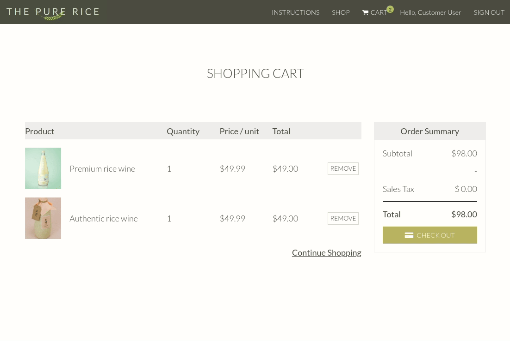
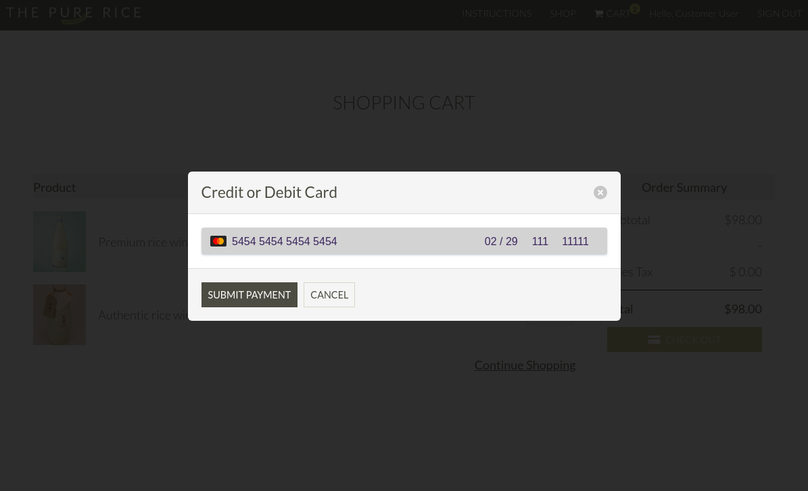

# Rice Wine Online Shop
Rice Wine Online Shop is fully responsive well-designed E-commerce application built with Rails and Stripe API which can accept payments.

🎉 You can checkout this awesome application at [http://rice-wine-ecommerce.herokuapp.com/](http://rice-wine-ecommerce.herokuapp.com/)!

## Technologies
* Rails (Ruby ver 2.6.3)
* SCSS (Built layout with Grid)
* Vanila JavaScript (Cool transform effects)
* PostgreSQL
* AWS S3 (Only on production)
* Fully responsive design
* Stripe API
* Heroku

## Screenshots



## Setup
### Prerequisites
* PostgreSQL installed
* Stripe API key

### Installation
```sh
git clone git@github.com:DaseulChun/rice_wine_online_shop.git
cd rice_wine_online_shop
yarn install --check-files
bundle install
rails db:setup
rails db:seed
rails s
```

* Please note that admin user whom can add, edit, delete products to the application is **already set in the database**. Once you run 'rails db:seed', you can sign in as both admin user and customer user on the application. Please refers to [/db/seeds.rb](https://github.com/DaseulChun/rice_wine_online_shop/blob/master/db/seeds.rb) if you want to change the credentials.
* Sign In credentials for the admin user:
    - Email: admin.user@example.com
    - Password: supersecret
* Sign In credentials for the customer user;
    - Email: customer.user@example.com
    - Password: supersecret
* You can sign up for as many customer user as you want, but NOT for the admin user.  

### Input Your Credentials
After the installation, create **/config/initializers/api_keys.rb** referred to [/config/initializers/api_keys.rb.example](https://github.com/DaseulChun/rice_wine_online_shop/blob/master/config/initializers/api_keys.rb.example) and input your Stripe credentials accordingly.

## Features
**Admin User**
* Can login
* Can CRUD(Create, Read, Update, Delete) products
* Upload images of products

**Customer User**
* All users can sign up & login
* All users can view products
* Authenticated users can add products to the cart
* Authenticated users can process payments(with test card, please see below)

**Test card for payments**

You can test the payments with this test card.
Please do NOT use the real card number to test it out.

* Test Card Number: 5454 5454 5454 5454
* Expiry Date: Any dates but future dates
* CVC: 111
* ZIP: 11111